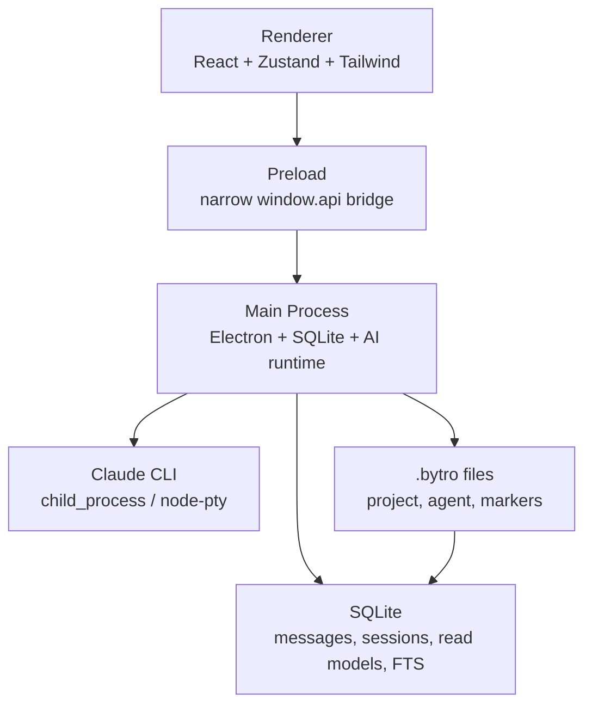

# Bytro Architecture Map

This is a top-level map. Detailed contracts live in `docs/architecture/`.

## System

## Architecture Documents

- `docs/architecture/runtime.md` — Electron process model, CJS build constraints, IPC security.
- `docs/architecture/ai-provider.md` — AI provider session model, Claude CLI event pipeline.
- `docs/architecture/memory-system.md` — memory truth sources, read models, recall bootstrap.

## Product And UI Documents

- `docs/design/ui-guidelines.md`
- `docs/design/design-agent-workflow.md`
- `docs/design/screens/chat.md`
- `docs/design/review-checklist.md`

## Active Review

- `docs/reviews/active/p0-code-review.md`

## Rule

If architecture changes, update the relevant `docs/architecture/*` file and link it from `docs/index.md`.
