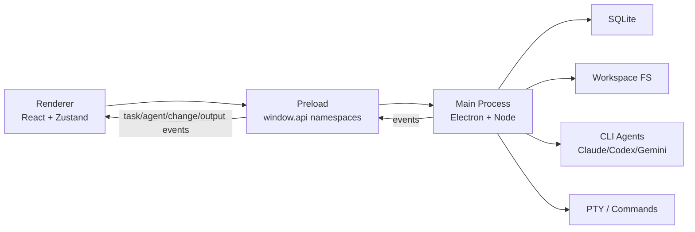
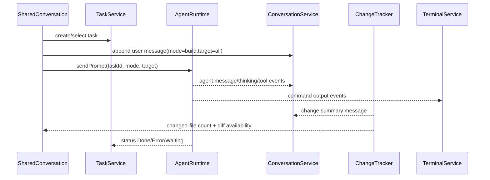

# AI Native Workspace Architecture

## Architecture Goal

Implement the Figma-defined AI-native development workspace as a local Electron IDE surface. The architecture should make task state, shared multi-agent conversation, file changes, code/docs/preview/settings panels, and terminal/build/test/diagnostics output first-class runtime concepts.

## UI-To-System Mapping

| Figma Surface | Renderer Module | Main Process Boundary | Durable Data |
|---|---|---|---|
| Task Rail | `TaskRail`, `taskStore` | `TaskService` | `tasks`, `task_agents`, `task_events` |
| Shared Conversation | `SharedConversation`, `conversationStore`, `agentStore` | `AgentRuntime`, `ConversationService` | `task_messages`, `task_agents`, `tool_calls` |
| Change Summaries | `ChangeSummary`, `changeStore` | `ChangeTracker`, `DiffService` | `file_changes`, `approvals` |
| Workspace Area | `WorkspaceArea`, `workspaceUiStore` | `WorkspaceService`, `FileService` | `workspace_tabs`, `panel_state` |
| Explorer / Outline | `ExplorerPanel`, `OutlinePanel` | `FileService`, `SymbolService` | optional cache tables |
| Code / Diff / Docs / Preview | `CodePanel`, `DiffPanel`, `DocsPanel`, `PreviewPanel` | `FileService`, `DiffService`, `PreviewService` | `workspace_tabs`, `file_changes`, `preview_sessions` |
| Bottom Output | `OutputPanel`, `terminalStore` | `TerminalService`, `CommandService` | `terminal_sessions`, `terminal_chunks`, `diagnostics` |
| Settings | `SettingsPanel`, `settingsStore` | `SettingsService`, `CredentialService` | `user_preferences`, `agent_profiles`, secure keychain |

## Runtime Components



## Main Process Services

### ProjectService

Owns recent projects, active project selection, folder opening, and project config.

Responsibilities:

- create/update/archive project records
- validate workspace paths
- store recent project metadata
- provide project-scoped config to other services

### TaskService

Owns task lifecycle and task rail state.

Responsibilities:

- create tasks from user intent
- update status: `Idle`, `Running`, `Waiting`, `Error`, `Done`
- persist task timestamps, agent count, and change count
- emit task events to the renderer
- bind messages, agents, changes, and output sessions to a task

### AgentRuntime

Owns role-based agent sessions and the adapter registry.

Responsibilities:

- map roles such as Planner, Architect, Coder, Reviewer to provider/model configs
- start/stop provider sessions
- route prompts by mode: build, plan, review, ask
- normalize provider output into internal events
- support multiple sessions per task even if MVP runs only one active provider

Agent runtime states:

- idle
- thinking
- editing
- reviewing
- waiting
- error
- done

### ConversationService

Owns task-scoped shared conversation.

Responsibilities:

- persist user, agent, plan, system, and change messages
- append thinking deltas without replacing completed content
- persist tool calls separately from message text
- expose copy/retry-friendly message content
- keep background task events from overwriting the active visible task

### ChangeTracker And DiffService

Own file-change visibility.

Responsibilities:

- watch active workspace paths
- associate file changes with task and agent session
- calculate changed-file status, additions, deletions, and diff hunks
- emit summary events for the shared conversation
- open Track Changes panel on request
- create approval requests for risky changes

### WorkspaceService And FileService

Own workspace panels, file tree, file content, docs, and open tabs.

Responsibilities:

- load file tree with ignored directory rules
- read files for code view and docs view
- maintain open file tabs
- support follow-suggestion chips
- provide read-only MVP first, then direct `monaco-editor` integration
- follow the Code Editor selection in `docs/architecture/workspace-surfaces-technology.md`

### TerminalService And CommandService

Own bottom output and command execution.

Responsibilities:

- maintain terminal/build/test/diagnostics sessions
- stream command output to the renderer
- record terminal chunks for reload recovery
- provide a React log viewer first, then upgrade interactive terminal rendering to `@xterm/xterm`
- expose process status and stop controls
- follow the Terminal selection in `docs/architecture/workspace-surfaces-technology.md`

### PreviewService

Owns local preview sessions and embedded preview lifecycle.

Responsibilities:

- detect and persist local dev-server preview URLs
- provide a P0 local URL card or sandboxed local iframe
- upgrade to Electron `WebContentsView` for full preview control
- enforce URL allowlists, navigation rules, and session partitioning
- follow the Preview selection in `docs/architecture/workspace-surfaces-technology.md`

### SettingsService And CredentialService

Own product preferences and agent/provider credentials.

Responsibilities:

- persist general, appearance, agent, git, data, notification, and network settings
- store API keys through OS keychain, not plaintext SQLite
- validate provider availability

## IPC Namespaces

Preload should expose narrow namespaces. Renderer must not access Node directly.

| Namespace | Example Methods | Events |
|---|---|---|
| `project` | `list`, `openFolder`, `setActive`, `getRecent` | `project:updated` |
| `task` | `create`, `list`, `select`, `updateStatus`, `cancel` | `task:created`, `task:updated` |
| `agent` | `listProfiles`, `start`, `stop`, `sendPrompt`, `setEnabled` | `agent:event`, `agent:status` |
| `conversation` | `listMessages`, `appendUserMessage`, `retryMessage` | `conversation:message`, `conversation:updated` |
| `tool` | `listCalls`, `getCall` | `tool:started`, `tool:updated`, `tool:completed` |
| `change` | `listForTask`, `getDiff`, `approve`, `reject` | `change:file`, `change:summary` |
| `workspace` | `listFiles`, `readFile`, `openTab`, `closeTab` | `workspace:fileChanged`, `workspace:tabsUpdated` |
| `terminal` | `createSession`, `write`, `stop`, `listChunks` | `terminal:data`, `terminal:status` |
| `settings` | `get`, `set`, `listProviders`, `setApiKey` | `settings:updated` |

## Renderer State Stores

Use focused Zustand stores to keep event routing explicit.

| Store | Owns |
|---|---|
| `projectStore` | active project, recent projects, open-folder flow |
| `taskStore` | task list, active task, filters, task counts |
| `agentStore` | active task agents, role state, enabled profiles |
| `conversationStore` | messages, thinking buffers, prompt mode, target agent |
| `toolStore` | tool call rows, compact summaries, expanded state |
| `changeStore` | changed-file summaries, selected diff, approval state |
| `workspaceUiStore` | resizable panel state, top tabs, file tabs, side/bottom panel visibility |
| `fileStore` | file tree, file contents, docs contents, loading/error states |
| `terminalStore` | output tabs, chunks, status by session |
| `settingsStore` | preferences and provider config |

## Data Model Additions

The current conversation and memory tables are useful, but the Figma workspace needs task-first durable entities.

```sql
CREATE TABLE IF NOT EXISTS projects (
  id TEXT PRIMARY KEY,
  name TEXT NOT NULL,
  path TEXT NOT NULL,
  status TEXT NOT NULL,
  config_json TEXT NOT NULL DEFAULT '{}',
  last_opened_at INTEGER,
  created_at INTEGER NOT NULL,
  updated_at INTEGER NOT NULL
);

CREATE TABLE IF NOT EXISTS tasks (
  id TEXT PRIMARY KEY,
  project_id TEXT NOT NULL,
  title TEXT NOT NULL,
  description TEXT,
  status TEXT NOT NULL,
  mode TEXT,
  created_at INTEGER NOT NULL,
  updated_at INTEGER NOT NULL,
  completed_at INTEGER
);

CREATE TABLE IF NOT EXISTS task_agents (
  id TEXT PRIMARY KEY,
  task_id TEXT NOT NULL,
  agent_profile_id TEXT NOT NULL,
  provider_session_id TEXT,
  role TEXT NOT NULL,
  status TEXT NOT NULL,
  model TEXT,
  created_at INTEGER NOT NULL,
  updated_at INTEGER NOT NULL
);

CREATE TABLE IF NOT EXISTS task_messages (
  id TEXT PRIMARY KEY,
  task_id TEXT NOT NULL,
  agent_id TEXT,
  type TEXT NOT NULL,
  content TEXT,
  metadata_json TEXT NOT NULL DEFAULT '{}',
  created_at INTEGER NOT NULL
);

CREATE TABLE IF NOT EXISTS task_events (
  id TEXT PRIMARY KEY,
  task_id TEXT NOT NULL,
  agent_id TEXT,
  event_type TEXT NOT NULL,
  payload_json TEXT NOT NULL DEFAULT '{}',
  created_at INTEGER NOT NULL
);

CREATE TABLE IF NOT EXISTS tool_calls (
  id TEXT PRIMARY KEY,
  task_id TEXT NOT NULL,
  message_id TEXT,
  agent_id TEXT,
  tool_name TEXT NOT NULL,
  input_json TEXT,
  result_text TEXT,
  status TEXT NOT NULL,
  started_at INTEGER NOT NULL,
  completed_at INTEGER
);

CREATE TABLE IF NOT EXISTS file_changes (
  id TEXT PRIMARY KEY,
  task_id TEXT NOT NULL,
  agent_id TEXT,
  path TEXT NOT NULL,
  status TEXT NOT NULL,
  additions INTEGER NOT NULL DEFAULT 0,
  deletions INTEGER NOT NULL DEFAULT 0,
  diff_text TEXT,
  approval_status TEXT,
  created_at INTEGER NOT NULL,
  updated_at INTEGER NOT NULL
);

CREATE TABLE IF NOT EXISTS approvals (
  id TEXT PRIMARY KEY,
  task_id TEXT NOT NULL,
  agent_id TEXT,
  file_change_id TEXT,
  operation TEXT NOT NULL,
  risk_level TEXT NOT NULL,
  detail_json TEXT NOT NULL DEFAULT '{}',
  status TEXT NOT NULL,
  created_at INTEGER NOT NULL,
  decided_at INTEGER
);

CREATE TABLE IF NOT EXISTS workspace_tabs (
  id TEXT PRIMARY KEY,
  project_id TEXT NOT NULL,
  task_id TEXT,
  panel_type TEXT NOT NULL,
  title TEXT NOT NULL,
  resource_ref TEXT,
  is_active INTEGER NOT NULL DEFAULT 0,
  created_at INTEGER NOT NULL,
  updated_at INTEGER NOT NULL
);

CREATE TABLE IF NOT EXISTS panel_state (
  id TEXT PRIMARY KEY,
  project_id TEXT NOT NULL,
  task_id TEXT,
  state_json TEXT NOT NULL,
  updated_at INTEGER NOT NULL
);

CREATE TABLE IF NOT EXISTS preview_sessions (
  id TEXT PRIMARY KEY,
  project_id TEXT NOT NULL,
  task_id TEXT,
  url TEXT,
  status TEXT NOT NULL,
  command TEXT,
  created_at INTEGER NOT NULL,
  ended_at INTEGER
);

CREATE TABLE IF NOT EXISTS terminal_sessions (
  id TEXT PRIMARY KEY,
  project_id TEXT NOT NULL,
  task_id TEXT,
  kind TEXT NOT NULL,
  status TEXT NOT NULL,
  command TEXT,
  cwd TEXT,
  created_at INTEGER NOT NULL,
  ended_at INTEGER
);

CREATE TABLE IF NOT EXISTS terminal_chunks (
  id TEXT PRIMARY KEY,
  session_id TEXT NOT NULL,
  seq INTEGER NOT NULL,
  stream TEXT NOT NULL,
  content TEXT NOT NULL,
  created_at INTEGER NOT NULL
);

CREATE TABLE IF NOT EXISTS diagnostics (
  id TEXT PRIMARY KEY,
  project_id TEXT NOT NULL,
  task_id TEXT,
  source TEXT NOT NULL,
  severity TEXT NOT NULL,
  path TEXT,
  line INTEGER,
  message TEXT NOT NULL,
  created_at INTEGER NOT NULL
);
```

## Event Contract

All agent/provider-specific output must be normalized before it reaches renderer stores.

```ts
type WorkspaceEvent =
  | { type: 'task.updated'; taskId: string; status: TaskStatus }
  | { type: 'agent.status'; taskId: string; agentId: string; status: AgentStatus }
  | { type: 'message.created'; taskId: string; message: TaskMessage }
  | { type: 'thinking.delta'; taskId: string; agentId: string; messageId: string; delta: string }
  | { type: 'tool.started'; taskId: string; toolCall: ToolCall }
  | { type: 'tool.updated'; taskId: string; toolCallId: string; patch: Partial<ToolCall> }
  | { type: 'change.file'; taskId: string; change: FileChange }
  | { type: 'change.summary'; taskId: string; summary: ChangeSummary }
  | { type: 'terminal.data'; sessionId: string; chunk: TerminalChunk }
  | { type: 'approval.requested'; taskId: string; approval: ApprovalRequest }
```

## Core Sequence: Build Prompt



## Implementation Order

1. Introduce task-first data model and `taskStore`.
2. Refactor Chat page into workspace shell matching TaskRail + SharedConversation + WorkspaceArea.
3. Route existing Claude CLI events into task-scoped conversation/tool/agent stores.
4. Add read-only file tree, file viewer, and docs panel.
5. Add change summary and basic diff panel.
6. Add bottom output model and log playback.
7. Add settings shell for agents/API keys/general/appearance.
8. Upgrade code and terminal surfaces to Monaco and xterm.js.
9. Add multi-agent scheduling and role-specific provider sessions.

## Migration Notes

- Existing `conversation` records can be treated as a compatibility layer until task-first screens are stable.
- A new task can be created automatically for any legacy conversation without a task.
- Existing `AIEvent` parsing remains useful, but events should be wrapped with `taskId` and `agentId`.
- Existing memory tables should attach to `project_id` and optionally `task_id` for recall and summaries.
- Avoid deleting old chat UI code until the workspace shell passes typecheck, build, and basic visual inspection.
