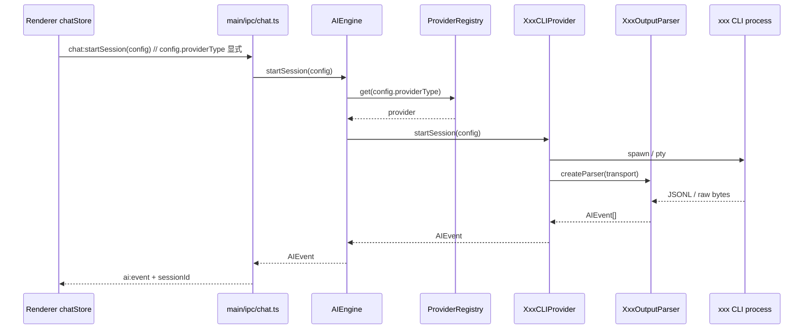

# AI Provider Architecture

Bytro 使用 session-based CLI Provider 架构。Claude CLI 是第一个 provider，架构设计为可插拔：新增一个 CLI 只需实现接口 + 写 Parser + 注册，不改主链路任何代码。

---

## 整体分层

```
CLIProvider 接口（契约层）
      ↕
BaseCLIProvider（生命周期公共逻辑：detect、spawn、事件路由、PTY fallback）
      ↕
XxxCLIProvider（差异层：args 构建、env 注入、parser 选择）
      ↕
XxxOutputParser（格式层：JSONL → AIEvent 标准化）
```

Parser 层是可扩展性的关键隔离点。每个 CLI 的 JSONL 格式不同，但都归一化到同一套 `AIEvent`。上层（AIEngine、IPC、Renderer）完全感知不到格式差异。

**新增 CLI 成本**：~半天，只需要：
1. 新建 `XxxCLIProvider extends BaseCLIProvider`（实现 3 个抽象方法）
2. 新建 `XxxOutputParser`（纯函数，用真实 CLI fixture 测试锁住格式）
3. 在 `createDefaultRegistry()` 里加一行注册

---

## 模式（Permission Modes）

| Permission Mode | Transport | 说明 |
|-----------------|-----------|------|
| `plan`          | `child_process` + stream-json | 只读探索，不修改文件 |
| `autoEdit`      | `child_process` + stream-json | 自动批准文件编辑 |
| `fullAuto`      | `child_process` + stream-json | 自动批准所有工具调用 |
| `manual`        | `node-pty` 交互模式 | 每步人工确认；不支持该模式的 provider 降级到 plan |

Permission Mode → CLI flag 的映射由各 provider 自己在 `meta.permissionFlags` 里声明，**不存在全局映射表**。

---

## 关键类型

```typescript
// src/main/ai/provider.ts

interface PermissionFlagMap {
  manual:   string[]   // PTY 模式的 flags（可为空，表示不支持）
  autoEdit: string[]
  plan:     string[]
  fullAuto: string[]
}

interface ModelInfo {
  id:              string   // "claude-sonnet-4-6"
  name:            string   // 显示名称
  contextWindow:   number   // token 数
  maxOutputTokens?: number
}

interface ProviderMeta {
  id:                   string          // "claude-cli" | "codex-cli" | ...
  name:                 string          // "Claude" | "Codex" | ...
  binary:               string          // "claude" | "codex" | ...
  vendor:               string          // "Anthropic" | "OpenAI" | ...
  models:               ModelInfo[]
  permissionFlags:      PermissionFlagMap
  supportsStreamJson:   boolean
  supportsInteractive:  boolean         // 是否支持 PTY manual 模式
}

interface ProviderConfig {
  enabled:    boolean
  binaryPath?: string
  extraEnv?:  Record<string, string>
}

interface SessionConfig {
  providerType:        string           // 显式存储，不靠 model 前缀推导
  model:               string
  permissionMode:      PermissionMode
  workingDir:          string
  sessionId?:          string
  appendSystemPrompt?: string
}

interface CLIProvider {
  readonly meta: ProviderMeta
  detect(): Promise<string | null>
  initialize(config: ProviderConfig): Promise<void>
  startSession(config: SessionConfig): Promise<Session>
  endSession(sessionId: string): Promise<void>
  sendMessage(sessionId: string, content: string): void
  respondPermission(sessionId: string, approved: boolean): void
  respondQuestion(sessionId: string, answer: string): void
  abort(sessionId: string): void
  onEvent(sessionId: string, handler: (event: AIEvent) => void): void
  offEvent(sessionId: string, handler: (event: AIEvent) => void): void
}
```

---

## OutputParser 抽象

每个 provider 实现自己的 parser，全部归一化输出 `AIEvent`：

```typescript
// src/main/ai/providers/parsers/output-parser.ts

interface OutputParser {
  // stream-json transport：每行 JSONL 进来，返回 0~N 个 AIEvent
  parseLine(line: string): AIEvent[]

  // PTY transport：raw 字节流进来，返回 0~N 个 AIEvent
  consume(data: string): AIEvent[]
}
```

各 provider 的格式差异由 parser 完全吸收：

| Provider | Parser | 格式特征 |
|----------|--------|---------|
| Claude   | `ClaudeOutputParser` | 增量 delta 流（`text_delta`、`tool_start` 分开） |
| Codex    | `CodexOutputParser`  | 完整 item（`item.completed` 一次性输出），需 fake streaming |
| Kimi     | `KimiOutputParser`   | role-based（`role:assistant/tool`），thinking 内嵌 |
| Gemini   | `GeminiOutputParser` | stream-json，格式待 spike 确认 |

### 各 Provider 真实 JSONL 格式（spike 采集）

**Codex `codex exec --json`**（已验证）：
```jsonl
{"type":"thread.started","thread_id":"..."}
{"type":"turn.started"}
{"type":"item.completed","item":{"id":"...","type":"agent_message","text":"Hello..."}}
{"type":"turn.completed","usage":{"input_tokens":26527,"cached_input_tokens":2432,"output_tokens":14,"reasoning_output_tokens":0}}
```

**Kimi `kimi --print --output-format stream-json`**（已验证）：
```jsonl
// 文本回复
{"role":"assistant","content":[{"type":"think","think":"..."},{"type":"text","text":"..."}]}

// 工具调用
{"role":"assistant","content":[{"type":"think","think":"..."}],"tool_calls":[{"type":"function","id":"tool_xxx","function":{"name":"Shell","arguments":"{\"command\":\"ls -la\"}"}}]}
{"role":"tool","content":[{"type":"text","text":"...output..."}],"tool_call_id":"tool_xxx"}
{"role":"assistant","content":[{"type":"think","think":"..."},{"type":"text","text":"..."}]}
```

**Gemini `-o stream-json`**：格式待 spike 确认后补充。

---

## BaseCLIProvider

公共基类，封装所有 provider 共用的生命周期逻辑：

```typescript
// src/main/ai/providers/base-cli-provider.ts

abstract class BaseCLIProvider extends EventEmitter implements CLIProvider {
  abstract readonly meta: ProviderMeta
  protected config: ProviderConfig | null = null
  protected sessions: Map<string, SessionEntry> = new Map()

  // 公共实现：which 查找 + --version
  async detect(): Promise<string | null>

  // 公共实现：存储 config
  async initialize(config: ProviderConfig): Promise<void>

  // 公共实现：session 生命周期、spawn、PTY、事件路由
  // supportsInteractive=false 时 manual 模式自动降级为 plan
  async startSession(config: SessionConfig): Promise<Session>
  async endSession(sessionId: string): Promise<void>
  sendMessage / respondPermission / respondQuestion / abort / onEvent / offEvent

  // ─── 子类必须实现 ───────────────────────────────────────

  // stream-json 模式的 CLI 参数（含 permission flags）
  protected abstract buildStreamJsonArgs(config: SessionConfig, resume: boolean): string[]

  // PTY 交互模式的 CLI 参数
  protected abstract buildManualArgs(config: SessionConfig, resume: boolean): string[]

  // 注入 API Key 的 env（从 Secrets 读取）
  protected abstract buildEnv(): Record<string, string>

  // 根据 transport 返回对应 parser
  protected abstract createParser(transport: 'stream-json' | 'pty'): OutputParser
}
```

ClaudeCLIProvider 改造后只剩差异逻辑：

```typescript
class ClaudeCLIProvider extends BaseCLIProvider {
  readonly meta = CLAUDE_META  // 内含 permissionFlags

  protected buildStreamJsonArgs(config, resume) { /* 现有 buildPrintArgs 逻辑 */ }
  protected buildManualArgs(config, resume)     { /* 现有 buildManualArgs 逻辑 */ }
  protected buildEnv()    { return { ANTHROPIC_API_KEY: Secrets.get('claude-cli') ?? '' } }
  protected createParser(transport) {
    return transport === 'pty'
      ? new ManualTuiParser()
      : new ClaudeOutputParser()   // 原 EventParser 封装
  }
}
```

---

## ProviderRegistry

```typescript
// src/main/ai/provider-registry.ts

class ProviderRegistry {
  private providers = new Map<string, CLIProvider>()

  register(provider: CLIProvider): void
  get(id: string): CLIProvider | undefined
  getAll(): CLIProvider[]

  // 启动时并行检测所有注册 provider，返回 id → 版本号 or null
  async detectAll(): Promise<Map<string, string | null>>

  // 已安装（detectAll 返回非 null）且 config.enabled=true 的 provider
  getAvailable(): CLIProvider[]
}

// 应用启动时调用一次
export function createDefaultRegistry(): ProviderRegistry {
  const registry = new ProviderRegistry()
  registry.register(new ClaudeCLIProvider())
  // Phase 2:
  // registry.register(new CodexCLIProvider())
  // registry.register(new GeminiCLIProvider())
  // registry.register(new KimiCLIProvider())
  return registry
}
```

---

## AIEngine

从持有单个 provider 改为通过 registry 查找，sessions map 记录每个 session 对应的 provider：

```typescript
// 改造前
class AIEngine {
  private provider: AIProvider | null = null
  setProvider(provider) { this.provider = provider }
  startSession(config) { return this.provider!.startSession(config) }
}

// 改造后
class AIEngine {
  constructor(private registry: ProviderRegistry) {}
  private sessions = new Map<string, { session: Session; provider: CLIProvider }>()

  async startSession(config: SessionConfig): Promise<Session> {
    const provider = this.registry.get(config.providerType)
    if (!provider) throw new Error(`Provider ${config.providerType} not available`)
    const session = await provider.startSession(config)
    this.sessions.set(session.id, { session, provider })
    return session
  }

  // 其余方法从 sessions map 找到对应 provider 再转发
  endSession(id) { this.sessions.get(id)?.provider.endSession(id) }
  sendMessage(id, content) { this.sessions.get(id)?.provider.sendMessage(id, content) }
  // ...
}
```

---

## Event Flow



---

## AIEvent Contract

Renderer 消费标准 `AIEvent`，不感知各 CLI 的原始格式。Parser 变更必须保持这些事件的语义稳定：

- `text_delta` — 文本增量（Codex/Kimi 的完整文本会拆成单次 delta 再发）
- `thinking_delta` — 思考过程增量
- `tool_start` — 工具调用开始
- `tool_result` — 工具调用结果
- `permission_request` — 权限确认请求
- `ask_user_question` — AI 向用户提问
- `todo_updated` — 任务列表更新
- `subagent_started / stopped / completed` — 子代理生命周期
- `complete` — 本轮 AI 回复完成（含 usage）
- `done` — turn 结束
- `error` — 错误

---

## DB Schema

```sql
-- API Key 加密存储（独立，不混入业务表）
CREATE TABLE IF NOT EXISTS secrets (
  id              TEXT PRIMARY KEY,     -- "cred:claude-cli"
  provider_id     TEXT NOT NULL UNIQUE,
  encrypted_value TEXT NOT NULL,        -- safeStorage 加密后 base64
  created_at      TEXT NOT NULL DEFAULT (datetime('now')),
  updated_at      TEXT NOT NULL DEFAULT (datetime('now'))
);

-- Provider 非敏感配置
CREATE TABLE IF NOT EXISTS provider_configs (
  id          TEXT PRIMARY KEY,         -- provider meta.id
  enabled     INTEGER NOT NULL DEFAULT 1,
  binary_path TEXT,
  extra_env   TEXT NOT NULL DEFAULT '{}',
  updated_at  TEXT NOT NULL DEFAULT (datetime('now'))
);
```

凭证读写通过 `src/main/core/secrets.ts` 封装，使用 Electron `safeStorage`（macOS Keychain / Windows DPAPI / Linux libsecret）。明文 API Key 从不写入磁盘或日志。

---

## IPC API

```
provider:list           → CLIProvider[] meta + 安装状态 + 是否已配置 Key
provider:detectAll      → registry.detectAll()（重新扫描已安装 CLI）
provider:configure      → 保存 provider_configs 表（enabled、binaryPath、extraEnv）
provider:setApiKey      → Secrets.set(providerId, key)
provider:hasApiKey      → Secrets.has(providerId)（不返回明文）
provider:testConnection → spawn provider --version 验证连通性
```

`chat:startSession` 新增 `providerType` 字段校验（从 registry 动态获取合法 provider id 列表，不再硬编码 MODELS 白名单）。

---

## File Map

| 层 | 文件 | 变更类型 |
|----|------|---------|
| 接口 | `src/main/ai/provider.ts` | **修改** — 加 `providerType`、`ModelInfo`、`PermissionFlagMap`、`CLIProvider` |
| 类型 | `src/main/ai/types.ts` | **修改** — 移除全局 `PERMISSION_MODE_CLI_MAP` |
| 引擎 | `src/main/ai/engine.ts` | **修改** — 单 provider → registry，sessions map 存 provider 引用 |
| 注册中心 | `src/main/ai/provider-registry.ts` | **新建** |
| 基类 | `src/main/ai/providers/base-cli-provider.ts` | **新建** |
| Parser 接口 | `src/main/ai/providers/parsers/output-parser.ts` | **新建** |
| Claude parser | `src/main/ai/providers/parsers/claude-output-parser.ts` | **新建** — 封装现有 EventParser + ManualTuiParser |
| Claude provider | `src/main/ai/providers/claude-cli.ts` | **修改** — 继承 BaseCLIProvider，仅保留差异逻辑 |
| Codex provider | `src/main/ai/providers/codex-cli.ts` | **新建**（Phase 2） |
| Gemini provider | `src/main/ai/providers/gemini-cli.ts` | **新建**（Phase 2） |
| Kimi provider | `src/main/ai/providers/kimi-cli.ts` | **新建**（Phase 2） |
| 凭证 | `src/main/core/secrets.ts` | **新建** |
| DB | `src/main/core/db.ts` | **修改** — 加 secrets 表、provider_configs 表 |
| IPC | `src/main/ipc/system.ts` | **修改** — 加 6 个 provider IPC handler |
| IPC | `src/main/ipc/chat.ts` | **修改** — 移除硬编码 MODELS，加 providerType 校验 |
| Preload | `src/preload/index.ts` | **修改** — 暴露 `api.provider.*` |
| ModelSelector | `src/renderer/src/components/ModelSelector.tsx` | **重写**（Phase 3） |
| Settings | `src/renderer/src/components/workspace/SettingsPanel.tsx` | **修改**（Phase 3） |
| Store | `src/renderer/src/stores/providerStore.ts` | **新建**（Phase 3） |
| Store | `src/renderer/src/stores/sessionConfigStore.ts` | **修改**（Phase 3） |
