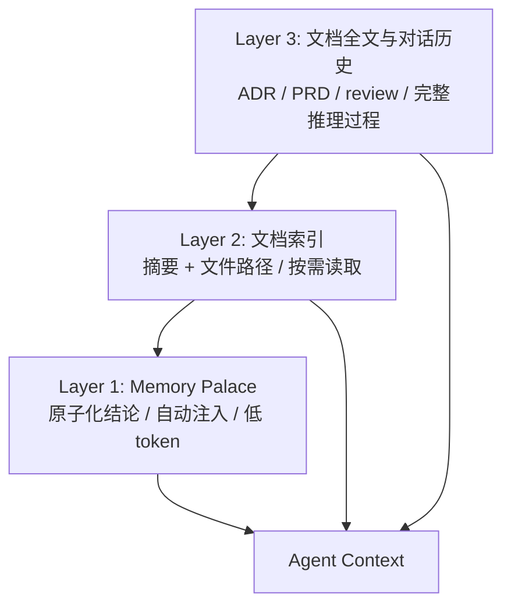
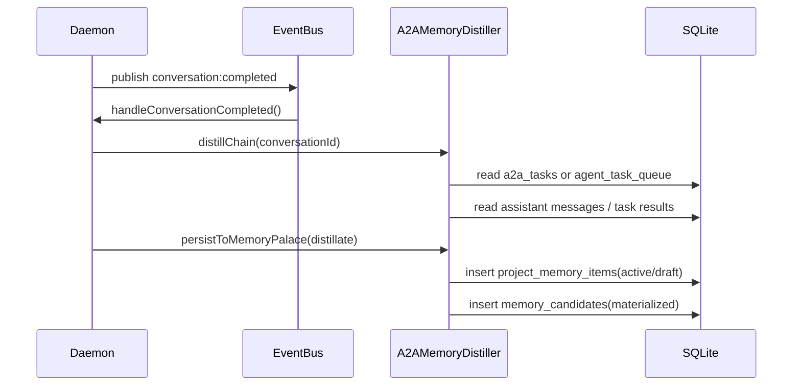

# Memory Palace Design

Memory Palace 是 Bytro 的项目级长期知识层。它不是普通笔记本，也不是完整文档库，而是把项目讨论、任务执行、架构决策和踩坑记录沉淀成可检索、可注入、可审计的结构化知识。

## 核心问题

多 Agent 开发会持续产生有价值的信息，但这些信息分散在对话、任务结果、代码 review 和文档里：

- Agent 下一轮任务不知道之前已经做过哪些架构决策。
- 踩坑经验只留在聊天记录里，后续实现 Agent 容易重复犯错。
- 完整技术文档 token 成本高，不适合每次注入。
- 用户需要能编辑、导出、迁移项目知识，而不是被动依赖某个 runtime 的上下文恢复。

Memory Palace 的目标是把"可复用结论"从"过程文本"中提取出来，并让 Agent 在后续任务中低成本获得这些结论。

## 设计目标

1. **低 token 成本**：自动注入摘要级知识，不把整篇文档塞进上下文。
2. **人机共用**：用户能在 UI 中创建、编辑、筛选和导入导出，Agent 能自动读取。
3. **可审计**：自动提取的记忆必须能追溯到来源 conversation / candidate。
4. **可迁移**：支持 JSONL 导出导入，后续可接入 git 同步。
5. **可控激活**：高确定性记忆自动 active，低确定性记忆先 draft，避免污染项目长期上下文。

## 记忆分类

当前 Memory Palace 使用 5 类项目记忆：

| Category | 用途 | 示例 | 默认状态 |
|---|---|---|---|
| `core` | 项目身份级事实 | "Bytro 是 Electron + React + Zustand + SQLite" | `active` |
| `antipatterns` | 踩坑、失败路径、反模式 | "Electron main process PATH 缺 `/opt/homebrew/bin` 会导致 CLI 启动失败" | `active` |
| `conventions` | 团队/代码约定 | "Provider 参数必须通过 driver 构造，不能散落在 UI 层" | `draft` |
| `decisions` | 架构或技术选择 | "Memory Palace 自动蒸馏直接写 project_memory_items，同时保留 candidate 审计" | `draft` |
| `architecture` | 模块关系、系统结构 | "EventBus → TaskQueue → RuntimeRegistry → AgentRuntime" | `draft` |

默认状态由 `src/main/ai/context-selector.ts` 的 `DEFAULT_STATUS_BY_CATEGORY` 定义：

```ts
export const DEFAULT_STATUS_BY_CATEGORY = {
  core: 'active',
  antipatterns: 'active',
  conventions: 'draft',
  decisions: 'draft',
  architecture: 'draft'
}
```

这个策略的原则是：事实和踩坑通常能直接减少错误，自动生效；约定、决策、架构描述可能影响未来实现方向，需要用户确认后再长期注入。

## 不应记忆的内容

Memory Palace 只记录未来会复用的项目知识。以下内容不应沉淀：

| 类型 | 示例 | 原因 |
|---|---|---|
| 临时状态 | "我正在改 daemon.ts" | 很快过期 |
| 过程描述 | "我先读了代码，然后跑了测试" | 不是可复用结论 |
| 通用知识 | "SQLite 是关系型数据库" | 非项目特有 |
| 单次输出 | "这次测试输出 313 passed" | 不指导未来任务，除非代表验收基线 |
| 情绪/态度 | "这个 bug 很烦" | 无工程价值 |
| 重复信息 | 已存在的同义记忆 | 增加噪声 |
| 敏感信息 | token、密钥、私有凭据 | 安全风险 |

判断标准：这条信息在未来任务中是否能降低决策成本、避免重复错误、或帮助 Agent 正确执行。如果不能，就不进入 Memory Palace。

## 三层知识架构

Memory Palace 与项目文档、对话历史分工明确：



### Layer 1: Memory Palace

存放原子化、可复用的结论。Agent 执行任务时由 `context-selector.ts` 按 category、关键词、角色过滤注入。

### Layer 2: 文档索引

存放文档摘要和路径，例如：

```json
{
  "category": "architecture",
  "title": "ADR-017: Slock Driver 模式",
  "content": "Provider driver 统一 spawn/parseLine/buildSystemPrompt/probe 等边界，详见 docs/architecture/decisions/adr-017-slock-driver.md",
  "sourceDoc": "docs/architecture/decisions/adr-017-slock-driver.md"
}
```

Agent 先看到摘要和路径，只有任务相关时才读取完整文档。

### Layer 3: 文档全文与对话历史

存放完整推理过程，包括 ADR、PRD、review、历史讨论。它们是人类和 Agent 深挖来源的材料，不默认进入每次上下文。

## 数据模型

Memory Palace 的主表是 `project_memory_items`：

| 字段 | 说明 |
|---|---|
| `id` | 记忆 ID |
| `workspace_id` | 工作区 ID |
| `kind` | 兼容旧字段，和 category 保持同步 |
| `category` | `core | architecture | conventions | antipatterns | decisions` |
| `title` | 短标题 |
| `content` | 记忆正文 |
| `status` | `active | draft` 等状态；只有 active 默认进入 UI list / context 注入 |
| `tags` | JSON array |
| `cited_by` | JSON array，后续记录引用来源 |
| `source_doc` | 文档路径或 `conversation:<id>` |
| `source_path/source_hash` | 文件同步来源，历史兼容 |
| `created_at/updated_at` | 时间戳 |

兼容策略：

- 写入时 `kind = category` 双写，保证旧查询路径仍能按 `kind` 工作。
- 读取时 `rowToEntry()` 优先使用 `category`，如果为空或为 `general`，再 fallback 到 `kind`。
- 迁移时会把已有 `kind != general` 的记录回填到 `category`，避免旧数据丢分类。

自动提取还会写 `memory_candidates` 作为审计日志：

| 字段 | 说明 |
|---|---|
| `kind/title/content` | 提取出的候选内容 |
| `source_conversation_id` | 来源 conversation |
| `source_message_id` | 对应 materialized memory item id |
| `confidence` | 置信度 |
| `status` | 当前自动落库后写 `materialized` |

设计取舍：`project_memory_items` 是 Agent 和 UI 使用的 canonical read/write model；`memory_candidates` 保留自动提取链路，便于回溯和调试。

## 写入路径

### 1. 用户手动写入

Memory Palace UI 通过 `memory-palace:create/update/delete` 直接操作 `project_memory_items`。用户是可信写入者，不走 candidate 审批流。

### 2. 自动蒸馏写入

完成一轮多 Agent conversation 后，daemon 触发链级蒸馏：



当前实现兼容两条任务链：

- Legacy A2A: `a2a_tasks`
- Daemon path: `agent_task_queue`

查询优先级固定为：先查 `a2a_tasks`，如果没有有效 `to_profile_id` 记录，再 fallback 到 `agent_task_queue`。这样旧 orchestrator 和新 daemon 都能复用同一个 distiller，同时避免同一 conversation 在两张表都有记录时重复蒸馏。

## 自动提取机制

`A2AMemoryDistiller` 当前使用轻量规则从完整协作链中提取：

| 输出 | 来源 | Category |
|---|---|---|
| 协作链摘要 | agent chain / task count / max depth | `architecture` |
| 决策点 | "决定/选择/采用/应该/必须..." | `decisions` |
| 协作惯例 | "惯例/模式/最佳实践/先...再..." | `conventions` |
| 失败教训 | failed tasks 或 "错误/失败/遗漏/缺失..." | `antipatterns` |

后续可升级为两阶段模型：

1. **候选生成**：规则或 LLM 从对话摘要中提取候选。
2. **分类判定**：输出 `{ category, title, content, confidence, reason }`，低 confidence 保持 draft。

LLM 提取应遵守同一套不记忆清单，避免把过程文本和临时状态写入长期记忆。

## 注入策略

`context-selector.ts` 按 category 优先级注入：

```ts
const CATEGORY_INJECTION_ORDER = [
  'core',
  'antipatterns',
  'conventions',
  'decisions',
  'architecture'
]
```

注入时还会结合任务关键词和 Agent role：

- implementation Agent 更需要文件、API、函数、模块相关记忆。
- review Agent 更需要风险、测试、安全、性能、bug、fix 相关记忆。
- planning Agent 更需要目标、决策、约束、方案、架构相关记忆。

文档索引只占少量预算，当前通过 `DOCS_BUDGET_RATIO = 0.05` 控制，避免文档列表挤占任务上下文。

Category 到注入位置的设计映射：

| Category | 注入位置 | 理由 |
|---|---|---|
| `core` | system prompt / context packet 前段 | 项目身份事实每次都需要，数量应很少 |
| `conventions` | system prompt 候选区，默认 draft 后人工确认 | 稳定约定会影响实现风格，需要确认后长期生效 |
| `antipatterns` | `project_memory_items` 按关键词和 role 过滤注入 | 踩坑只在相关任务中需要，但价值高，默认 active |
| `decisions` | context packet / contextSnapshot 附近 | 决策需要和当前任务上下文一起解释，不应孤立塞入 system prompt |
| `architecture` | Memory Palace 摘要 + sourceDoc 指向完整文档 | 架构知识较长，默认注入摘要，全文按需读取 |

当前代码先通过 `project_memory_items` 统一承载这些类别，再由 `context-selector.ts` 按 category order、关键词和 role 过滤；后续可以把确认后的 `core/conventions` 提升到更靠前的 system prompt 区域。

## JSONL 与迁移

当前 export/import IPC 已支持 JSONL：

| handler | 行为 |
|---|---|
| `memory-palace:export` | 导出 workspace 下 active memory 为 JSONL |
| `memory-palace:import` | 从 JSONL 导入，按 id 冲突跳过 |

JSONL 行格式：

```json
{"id":"...","category":"antipatterns","title":"...","content":"...","tags":["provider"],"sourceDoc":"conversation:...","createdAt":1760000000,"updatedAt":1760000000}
```

Phase 1 是全量导出 + upsert/skip 导入。Phase 2 可以演进为 append-only：

- 修改一条记忆时新增新行。
- 旧行标记 `superseded_by`。
- 删除写 tombstone。
- git 同步只需要合并 JSONL，不需要二进制 SQLite 合并。

Git 同步必须有污染防护：

- Agent 自动提取或导入 JSONL 后，只能更新本地工作区状态，不能自动 commit。
- UI 需要显示 "Memory Palace has uncommitted export changes" 之类的提示，由用户决定是否导出并提交。
- `.bytro/memory/*.jsonl` 如果纳入 git，应优先使用 append-only 合并策略；冲突时保留双方行，再由 Memory health UI 提示重复或 superseded 关系。
- SQLite 文件不应作为跨机器同步对象；JSONL 是迁移和协作格式，SQLite 是本机索引/read model。

## 新项目冷启动

Memory Palace 不应该依赖用户手动从零填写。新项目初始化建议分三层：

| 层 | 机制 | 产物 | 状态 |
|---|---|---|---|
| Layer 0 | 快速扫描 | 技术栈、目录结构、package scripts | planned |
| Layer 1 | 代码模式分析 | IPC 命名、状态管理、测试约定、provider 边界 | planned |
| Layer 2 | 文档扫描 | docs/README/ADR 摘要 + sourceDoc 索引 | partial |
| Layer 3 | 对话蒸馏 | conversation:completed 后自动沉淀 | implemented |

建议 UI 上提供两档扫描：

- Quick Scan：30 秒内完成，生成 core + docs index。
- Deep Scan：2 分钟左右，分析关键模块和历史文档，用户确认后写入 draft。

Scanner 采用插件接口，按项目类型选择 nodejs/python/rust/generic 等实现：

```ts
interface ProjectScanner {
  id: string
  detect(rootDir: string): Promise<boolean>
  scan(rootDir: string, options: {
    mode: 'quick' | 'deep'
  }): Promise<Array<{
    category: 'core' | 'architecture' | 'conventions' | 'antipatterns' | 'decisions'
    title: string
    content: string
    tags: string[]
    sourceDoc?: string
    confidence: number
  }>>
}
```

`detect()` 只判断是否适用，例如 `package.json`、`pyproject.toml`、`Cargo.toml`。`scan()` 生成 Memory Palace draft/core facts，写库前仍需要去重和用户确认。Quick Scan 产出的 `core` facts 必须先检查 `project_memory_items WHERE workspace_id = ? AND category = 'core'`，对已存在的项目身份、技术栈、package scripts 条目做跳过或合并，避免每次扫描重复写入同一批基础事实。

## 竞品与参考

| 系统 | 做法 | Bytro 借鉴 |
|---|---|---|
| Slock | `MEMORY.md` 作为恢复锚点，详细内容放 notes | Memory Palace 应保留索引和摘要，不把所有全文注入 |
| Multica | Skill = `SKILL.md` + supporting files，按角色注入 | Bytro 后续可把高频 playbook 升级成 skill |
| Claude/Codex 项目记忆 | 依赖 runtime 自身上下文和文件读取 | Bytro 需要 runtime 无关的 SQLite/JSONL 记忆层 |
| 传统项目文档 | ADR/PRD/README 保存完整推理 | Memory Palace 保存文档摘要与路径，全文按需读取 |

关键差异：Bytro 的 Memory Palace 是面向多 Agent 协作的结构化 read model，而不是单个模型的私有上下文。

## 实施计划

### Phase 1: 已完成

- `project_memory_items` 增加 `category/tags/source_doc`。
- Memory Palace UI CRUD、筛选、tags 编辑。
- `[PROJECT DOCS]` 轻量文档索引注入。
- `context-selector.ts` 按 category 优先级和 role 过滤注入。
- JSONL export/import IPC、preload、store。
- `conversation:completed` 触发 A2A distiller。
- 自动蒸馏直接写 `project_memory_items`，同时保留 `memory_candidates(materialized)` 审计。

### Phase 2: 近期

- UI 展示 draft/active 状态，支持人工确认 draft。
- 去重：先用 FTS5 BM25 查询 title/content，命中高度相似条目时跳过或合并；Phase 3 再引入向量检索。
- JSONL append-only：`superseded_by`、tombstone、git merge 友好。
- Project Scanner Quick Scan：生成 core facts + docs index。
- `cited_by` 自动写入：Agent 引用某条 memory 时记录 conversation/task。

Phase 2 去重的最小策略：

1. 写入前用 `memory_fts MATCH buildFtsQuery(title + ' ' + content)` 搜当前 workspace。
2. 如果 top hit 的 BM25 rank 低于阈值，且 category 相同，则视为疑似重复；初始建议阈值为 `rank < -2.0`（FTS5 BM25 越小越相关）。
3. 自动蒸馏路径直接跳过疑似重复；用户手动写入路径提示 "可能已有相似记忆" 并允许覆盖。
4. 阈值需要通过真实项目数据校准，默认先保守，宁可漏掉重复也不要误删新知识。

### Phase 3: 远期

- LLM 二次判定：提取候选后由轻量模型输出分类、置信度、理由。
- 向量检索：冷记忆不主动注入，只在搜索命中时读取。
- Playbook/Skill 升级：高频 conventions 和 antipatterns 可转成 Agent skill。
- Memory health UI：重复、过期、冲突、低置信度记忆提醒。

## 当前代码位置

- `src/main/ipc/memory-palace.ts` — UI CRUD + JSONL export/import
- `src/main/core/memory-index.ts` — `project_memory_items` / `memory_candidates` 写入 API
- `src/main/core/db.ts` — schema、FTS trigger、category/source_doc migration
- `src/main/ai/context-selector.ts` — category priority、role filter、docs index injection
- `src/main/ai/a2a-memory-distiller.ts` — chain-level distillation
- `src/main/daemon/daemon.ts` — `conversation:completed` trigger
- `src/preload/index.ts` — `window.api.memoryPalace`
- `src/renderer/src/stores/memoryPalaceStore.ts` — Memory Palace store
- `src/renderer/src/components/workspace/MemoryContent.tsx` — UI 面板

## Related

- `docs/features/memory-palace.md`
- `docs/architecture/a2a-memory-bridge.md`
- `docs/architecture/memory-system.md`
- `docs/features/memory-injection.md`
