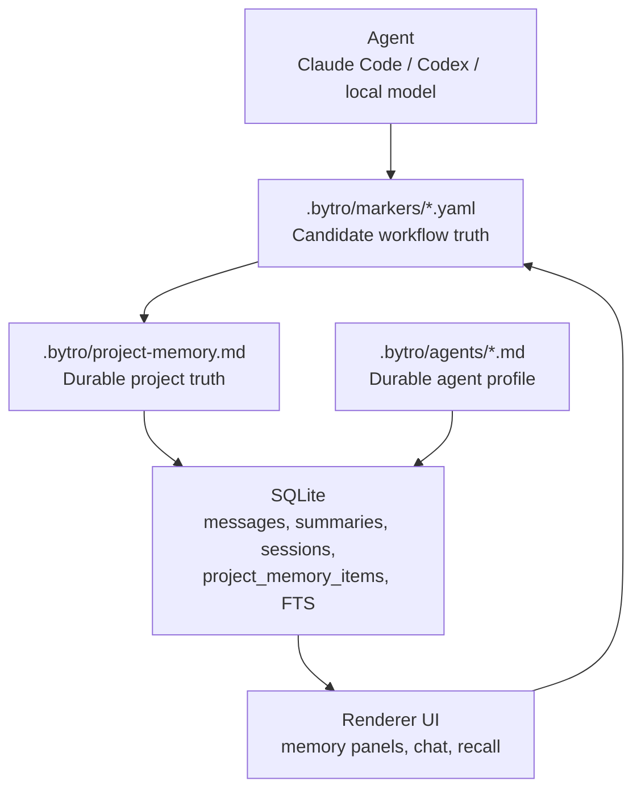

# Memory System Architecture

Bytro memory has three layers: durable files, structured runtime data, and compiled read models.

## Boundary Diagram

## Truth Source Rules

- `.bytro/project-memory.md` is the durable project memory truth source.
- `.bytro/agents/*.md` is the durable agent memory truth source.
- `.bytro/markers/*.yaml` is the durable candidate workflow source.
- `project_memory_items` is a read model / index projection.
- `memory_fts` and similar FTS tables are compiled indexes.
- `agent_sessions` are runtime audit/continuity records, not memory.

## Write Rules

- Renderer must not directly create project memory read-model rows.
- Candidate approval must materialize to durable project memory, then update read models.
- Deleting project memory must update the durable source or write a tombstone, then rebuild/sync.
- Marker filenames must be basename-only `.yaml` names and must stay inside `.bytro/markers`.

## Recall Bootstrap

Agent startup context should be assembled from:

1. Project memory.
2. Relevant conversation summary.
3. Agent profile.
4. Current task/user prompt.

Do not depend on Claude/Codex resume state for long-term continuity.

## Related

- `specs/2026-04-29-bytro-memory-system-design.md`
- `plans/2026-04-29-bytro-memory-system.md`
