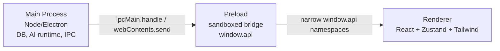

# Runtime Architecture

Bytro is an Electron desktop app with three runtime surfaces.

## Process Model



## Build Constraints

- Main output is CJS: `out/main/index.js`.
- Preload output is CJS: `out/preload/index.js`.
- Do not add `"type": "module"` to `package.json`.
- `better-sqlite3` is a native CJS dependency and must stay behind the DB boundary.
- Electron sandboxed preload must be CJS. ESM preload may fail to inject `window.api`.

## Security Boundaries

- Renderer has no Node integration.
- Preload exposes only narrow namespaced methods through `window.api`.
- Main process validates IPC payloads at runtime.
- External URLs must go through protocol allowlists.
- SQL must not interpolate renderer-controlled column names.

## Router Rule

Renderer uses `HashRouter`. Do not switch to `BrowserRouter` unless a production-safe custom protocol and route fallback are added.

## Verification

Use these checks after runtime/build changes:

```bash
pnpm run typecheck
pnpm build
pnpm dist
```
