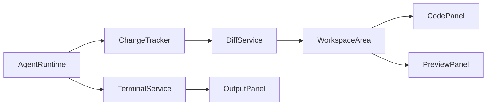

# Workspace Surface Technology Choices

## Goal

Choose concrete technologies for the three heavy workspace surfaces in the Figma prototype:

- Code Editor
- Terminal / Build / Test / Diagnostics
- Preview

The guiding rule is two-stage delivery: build a lightweight MVP surface first, then upgrade the same service and state boundaries to the full implementation. The MVP should establish task-scoped data flow and UI behavior before introducing heavy editor, PTY, and embedded-browser complexity.

## Summary Decision

| Surface | P0 MVP | P1 Full Implementation | Do Not Use |
|---|---|---|---|
| Code Editor | React file viewer + existing `react-syntax-highlighter` | Direct `monaco-editor` integration, lazy-loaded, with Monaco Diff Editor | Custom editor, VS Code web embed |
| Terminal / Output | React log viewer backed by `terminal_sessions` and `terminal_chunks` | `@xterm/xterm` + `@xterm/addon-fit` + existing `node-pty` in main process | Renderer-spawned shells, raw unbounded logs |
| Preview | Local-only sandboxed `iframe` or placeholder URL card | Electron `WebContentsView` controlled by main process | Electron `<webview>`, deprecated `BrowserView` |

## Code Editor

### Decision

Use a staged editor strategy:

1. P0: implement a read-only code viewer using the current dependency `react-syntax-highlighter`.
2. P1: install and integrate `monaco-editor` directly, not through a React wrapper.
3. P1/P2: use Monaco's Diff Editor for richer diffs after the basic Track Changes panel is stable.

### Why Monaco

- It is the browser-based editor generated from VS Code sources.
- It has first-class code editing primitives: models, markers, diff editor, find, folding, minimap, hover, selection APIs, and language workers.
- The prototype visually targets a VS Code-like editing surface, so Monaco matches user expectation better than a lightweight text editor.

### Why Not CodeMirror As Primary

CodeMirror 6 is excellent for lighter, highly customized editors. It is smaller and more modular, but Bytro's desired surface is IDE-like: file tabs, diagnostics, diff, TypeScript/JavaScript language behavior, and future LSP-style features. Monaco is heavier, but the product is a desktop IDE, so the tradeoff is acceptable.

### Integration Plan

P0 read-only viewer:

- `FileService.readFile(projectId, path)` reads file content in the main process.
- Renderer stores file content in `fileStore`.
- `CodePanel` renders:
  - file tabs
  - current file header
  - line numbers
  - syntax-highlighted read-only content
  - loading, empty, error, binary/large-file states

P1 Monaco editor:

- Add dependencies:
  - `monaco-editor`
- Lazy import Monaco only when the Code panel is first opened.
- Use the ESM build.
- Define `MonacoEnvironment.getWorker` for editor, TypeScript/JavaScript, JSON, CSS, and HTML workers.
- Keep model lifecycle in `CodeEditorService`:
  - one Monaco model per open file URI
  - dispose models when tabs close or project changes
  - keep dirty state separate from file content loaded from disk
- Save through `workspace.writeFile`, not renderer filesystem access.
- Use `monaco.editor.createDiffEditor` for P1/P2 diff views once `file_changes.diff_text` is reliable.

### Large File And Safety Rules

- Files above a configured limit should open read-only or show a large-file warning.
- Binary files should show metadata, not raw bytes.
- Renderer never reads files directly.
- Save operations go through preload IPC and main-process validation.
- Unsaved editor buffers must not be overwritten by background agent file-change events without a visible conflict state.

### Recommended API Shape

```ts
window.api.workspace.listFiles(projectId, dir)
window.api.workspace.readFile(projectId, path)
window.api.workspace.writeFile(projectId, path, content, expectedVersion)
window.api.workspace.watchFile(projectId, path)
```

## Terminal / Build / Test / Diagnostics

### Decision

Use a staged terminal strategy:

1. P0: implement a React output/log viewer for terminal/build/test/diagnostics.
2. P1: add `@xterm/xterm` for interactive terminal rendering.
3. Reuse existing `node-pty` in the main process for real PTY sessions.

### Why xterm.js + node-pty

- `node-pty` creates pseudoterminal-backed processes and is already in the project.
- xterm.js is designed to render terminal streams in the browser and is commonly paired with `node-pty`.
- This pairing supports real interactive CLI/TUI behavior, which is required for manual Claude CLI mode and future command terminals.

### Package Choice

Use scoped xterm packages:

- `@xterm/xterm`
- `@xterm/addon-fit`
- `@xterm/addon-web-links`
- Optional after profiling: `@xterm/addon-search`, `@xterm/addon-webgl`, `@xterm/addon-serialize`

Avoid legacy unscoped packages such as `xterm-addon-fit` and `xterm-addon-attach`; the xterm project has moved core packages under the `@xterm` scope.

### Integration Plan

P0 log viewer:

- `TerminalService` owns sessions:
  - `kind`: `terminal | build | test | diagnostics`
  - `status`: `idle | running | stopped | exited | error`
  - `command`, `cwd`, `created_at`, `ended_at`
- Output is appended as `terminal_chunks`.
- Renderer renders chunks in a virtualized or capped log list.
- Build, test, and diagnostics use the same storage model but can render structured summaries.

P1 interactive terminal:

- Main process spawns PTY sessions with `node-pty`.
- Renderer creates `Terminal` from `@xterm/xterm`.
- Renderer sends input and resize events through IPC.
- Main process streams PTY output through `terminal:data`.
- `@xterm/addon-fit` recalculates cols/rows on container resize and sends `terminal:resize`.
- Output writes should be batched before calling `terminal.write()` to avoid UI stalls during large agent output.

### Command Routing

Use two execution modes:

| Mode | Runtime | Use Case |
|---|---|---|
| Log command | `child_process.spawn` | build/test commands where interactivity is not needed |
| Interactive terminal | `node-pty` | shell, Claude manual mode, TUIs, commands requiring stdin |

Both modes publish into the same `terminal_sessions` and `terminal_chunks` model.

### Safety Rules

- Renderer cannot spawn commands.
- Commands run only inside the active project root or an approved worktree.
- Destructive commands should create approval requests before execution.
- Output is capped by size and persisted as chunks; old chunks can be compacted.
- PTY sessions must be killed on project close, app quit, or task cancellation unless explicitly detached.

### Recommended API Shape

```ts
window.api.terminal.createSession({ projectId, taskId, kind, cwd, command })
window.api.terminal.write(sessionId, data)
window.api.terminal.resize(sessionId, cols, rows)
window.api.terminal.stop(sessionId)
window.api.terminal.listChunks(sessionId, afterSeq)
```

## Preview

### Decision

Use a staged preview strategy:

1. P0: preview is a local-only URL card or sandboxed iframe for trusted local dev URLs.
2. P1: implement real preview with Electron `WebContentsView`.
3. Do not use Electron `<webview>`.
4. Do not use `BrowserView`; it is deprecated in favor of `WebContentsView`.

### Why Not `<webview>`

Electron's own docs recommend avoiding `<webview>` because of stability and architectural concerns. It is also disabled by default and requires enabling `webviewTag`, which expands the renderer attack surface.

### Why WebContentsView For Full Preview

`WebContentsView` is created and controlled in the main process. It gives the app stronger control over navigation, permissions, session partitioning, devtools, and lifecycle than an iframe. It is the right choice once the preview needs to behave like an embedded browser, especially for local dev apps with navigation and reload controls.

### P0 Preview

P0 should not block on embedded-browser integration.

Implement:

- URL/status card for detected local dev servers.
- Open in system browser action.
- Optional `iframe` only for allowlisted local origins:
  - `http://localhost:*`
  - `http://127.0.0.1:*`
  - `http://[::1]:*`
- `sandbox` attribute with the minimum capabilities needed.

P0 iframe limitations are acceptable:

- Some apps block iframe embedding.
- Cross-origin inspection and navigation control are limited.
- It is only a visual convenience, not the final preview engine.

### P1 WebContentsView Integration

Main process:

- `PreviewService` creates one `WebContentsView` per preview session.
- The view loads only allowlisted URLs by default.
- Use partitioned sessions per project, e.g. `persist:preview:<projectId>`.
- Disable Node integration and remote module.
- Handle `will-navigate`, `setWindowOpenHandler`, permissions, downloads, and external protocols.

Renderer:

- `PreviewPanel` owns toolbar UI:
  - URL input
  - back/forward
  - reload
  - stop
  - open external
  - devtools in development
- Renderer reports panel bounds to main process using `ResizeObserver`.
- Main process positions the `WebContentsView` over the preview content area.
- When the Preview panel is hidden or tabbed away, main process hides or detaches the view.

### Recommended API Shape

```ts
window.api.preview.createSession({ projectId, taskId, partition })
window.api.preview.loadURL(sessionId, url)
window.api.preview.goBack(sessionId)
window.api.preview.goForward(sessionId)
window.api.preview.reload(sessionId)
window.api.preview.stop(sessionId)
window.api.preview.setBounds(sessionId, bounds)
window.api.preview.destroySession(sessionId)
```

## Cross-Surface Data Flow



## Implementation Order

1. P0 Code Viewer: file tree, read file, syntax-highlighted read-only view, file tabs.
2. P0 Output Viewer: terminal/build/test/diagnostics tabs backed by persisted chunks.
3. P0 Preview Card: local URL display, open external, optional sandboxed local iframe.
4. P0 Track Changes: file list and basic diff using existing text rendering.
5. P1 Monaco: direct `monaco-editor` integration and save/dirty model.
6. P1 xterm: interactive PTY terminal with fit/resize and output batching.
7. P1 WebContentsView: real embedded preview controlled from main process.

## Source Notes

- Monaco Editor official repository: https://github.com/microsoft/monaco-editor
- CodeMirror 6 reference docs: https://codemirror.com/docs/ref/
- xterm.js official repository: https://github.com/xtermjs/xterm.js
- node-pty official repository: https://github.com/microsoft/node-pty
- Electron Web Embeds docs: https://www.electronjs.org/docs/latest/tutorial/web-embeds
- Electron BrowserView deprecation docs: https://www.electronjs.org/docs/latest/api/browser-view

